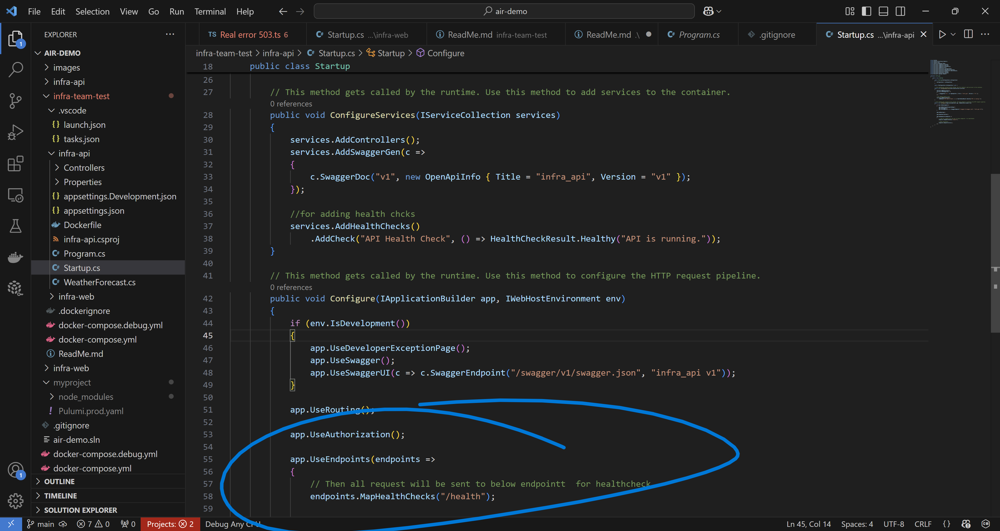
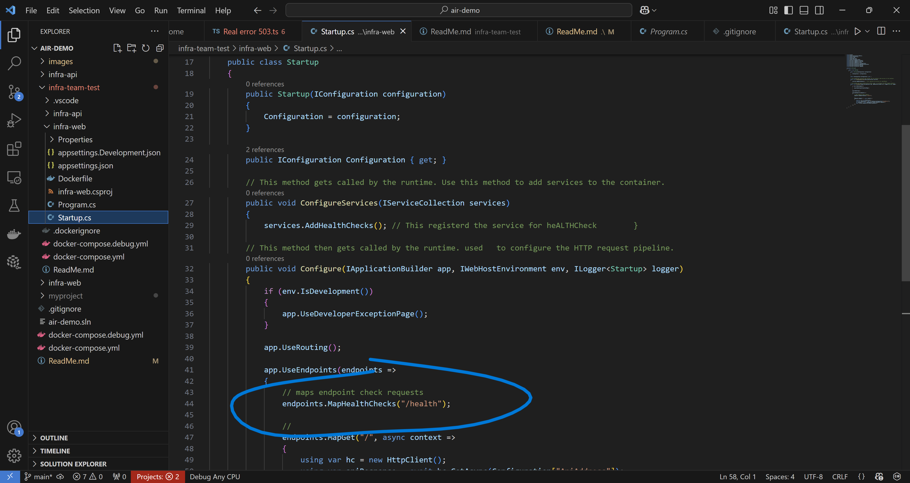
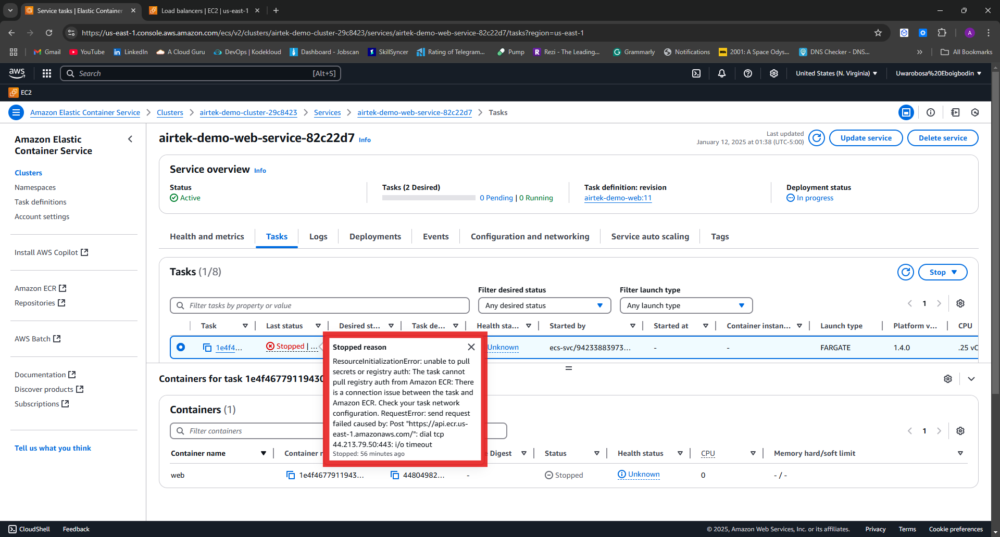

# Deploying into AWS with Pulumi : A DotNet 5.0 build

In This repo i documented my  approach to deploying a **Web UI** and **API** on **AWS ECS**, leveraging **Pulumi** for IAC. The project was a blend of implementing robust configurations, possible real-world challenge and yes, the ``HTTP 503 errors`` I had to talk about that annoying thing elaborately in this read me.

Based off instructions, the architecture ensures:

- The **API** runs securely in private subnets, accessible only by the Web UI.
- The **Web UI** is exposed through  an **Application Load Balancer (ALB)**.
- Health check endpoints were introduced to stabilize ECS task registration with ALB target groups.

While the process went smoothly at times, there were moments where I had to pause, scratch my head, and wonder, *"What am I missing?!"* These are exactly the types of things we like to iron out before the weekend. or else! (we know how that  goes).

---

##  Tech Stack and Tools Used

- **Pulumi**: For provisioning AWS resources with reusable IaC using Typescript.
- **AWS ECS**: For container orchestration.
- **AWS ALB**: For routing traffic and performing  frequent health checks.
- **CloudWatch**:  For digging deep into logs and metrics.
- **Docker and ECS**: For containerizing services.
- **IAM Roles**: For secure resource access.

---

##  Architecture Overview

### Key Components:

1. **API Service**: 
   - Deployed in private subnets for security.
   - Accessible only by the Web UI.

2. **Web UI**:
   - Deployed in public subnets with ALB routing on port 80.
   - Configured to handle public traffic securely.

3. **ALB**:
   - Routes traffic to ECS tasks.
   - Monitors health via the `/health` endpoint.

---

##  Key Modifications

### Health Check Endpoints

During the initial setup, ECS tasks were failing health checks because the services lacked `/health` endpoints. I quickly addressed this by updating the source code to include proper health endpoints.

- **API Service** (`Startup.cs`): I Added `/health` endpoint to confirm readiness.

*Updated the  `Startup.cs` for API to create an endpoint for healthchecks*

- **Web UI Service** (`Startup.cs`): I also Added `/health` endpoint for Web UI health monitoring.

*Also edited the  `Startup.cs` for WEB to create an endpoint for healthchecks*

- **Test Ran the Endpoint** 

*This will return a `OK 200` instead of Healthy when ALB makes an HTTP request or if i did a `curl http://localhost:3000/health`*

---

##  Pulumi Infrastructure Deployment

Pulumi was the IaC tool of choice to provision AWS resources like VPCs, subnets, ECS clusters, and ALB configurations. This ensured a consistent and scalable deployment process.

### Highlights of my Pulumi Configurations:

#### ECS Task Definition:
I added health check configurations to enable seamless registration with the ALB.

#### ALB Target Group:
Defined `/health` as the health check endpoint so as to make sure the HTTP request from ALB always return `Ok 200` which means the  container is healthy

#### Security Groups:
Ensured ALB and ECS tasks could communicate securely without any network bottlenecks.

*The  syntax for curating a befitting security group for the apps delicate network requirements*

---

##  Challenges and Troubleshooting

### Health Check Failures

*The API services is constantly being marked as unhealthy  hence preventing load balancing *

**Issue**: 
ECS tasks kept failing to register with the ALB.

**Root Cause**:
- Missing `/health` endpoints in the application code.

**Solution**:
- Introduced `/health` endpoints for both the API and Web UI in the respective `Startup.cs` files, and i also added it to the Pulumi script to ensure it is the default health check endpoint for the target group in front of the ALB.
- Configured ALB target groups to point to `/health`.

---
### RecourceInitializationError

*The Web service on the other hand suffered this *

**Root Cause Analysis**

The error itself suggested that the ECS tasks in private subnets couldn't connect to the ECR endpoint. I systematically checked all possible causes, and here’s a breakdown of what I found and how I tackled it.

**1. Missing NAT Gateway**
ECS tasks running in private subnets require a **NAT Gateway** to access the internet for pulling images from ECR. My first suspicion was a possible misconfiguration with the NAT Gateway or the associated route tables.

- **Check**: I reviewed the Pulumi configuration to ensure private subnets were properly routed through the NAT Gateway.  
- **Outcome**: Found an issue with the NAT Gateway’s association to the route table, fixed it, and re-routed the traffic. This resolved part of the connectivity issue.

**2. IAM Role Misconfiguration**
The ECS task execution role needs the correct permissions to pull images from ECR. Specifically, the **`AmazonECSTaskExecutionRolePolicy`** must be attached to the role.

- **Check**: Verified the attached IAM policies in the AWS Console and also listed them via CLI.  
- **Outcome**: IAM permissions were correctly configured, so this wasn’t the root cause. Still, it was worth confirming to rule out any surprises.

**3. DNS Resolution Issues**
Private subnets must have **DNS resolution** and **hostnames** enabled for tasks to resolve the ECR endpoint correctly.

- **Check**: I ensured that DNS resolution was enabled in the VPC settings. To confirm further, I tested DNS resolution from an instance in the private subnet to ensure it could resolve ECR’s endpoint.  
- **Outcome**: DNS resolved successfully, confirming there were no misconfigurations here. Another potential cause ruled out.

**4. Security Group Rules**
Misconfigured **security groups** could block communication between the ECS tasks, NAT Gateway, and ECR. This was my next target for verification.

- **Check**: I inspected all inbound and outbound rules for both ECS tasks and the NAT Gateway. Specifically, I ensured:
  - The NAT Gateway’s security group allowed outbound internet access.
  - ECS tasks had outbound rules permitting all traffic.  
- **Outcome**: Security groups were configured correctly, so no adjustments were needed here.

## **Root Cause**
After digging through logs and running these checks, it turned out the **missing or misconfigured NAT Gateway** was the primary issue. Correcting this and ensuring the private subnets had proper internet access resolved the `ResourceInitializationError`.

---

### HTTP 503 Errors

*This pops up anytime i tried to access the application, mostly due to the two issues above *

**Issue**: 
Even after i fixed the health check failures, the ALB occasionally returned `503 Service Unavailable`. This is the kind of issue that feels minor but keeps you up at night wondering what you missed!

**Analysis**:
- Possible reasons:
  - ECS tasks not becoming "ready" in time.
  - Security group misconfigurations.
  - Load balancer timing mismatches during deregistration.

**Resolutions Attempted**:
1. Verified task readiness through **CloudWatch Logs**.
2. Adjusted `deregistrationDelay` in the ALB target group to ensure tasks have time to stabilize.
3. Ran connectivity tests using `curl` to debug internal networking between the Web UI and API.
4. and the last step i took was i l created an intance in the private subnet, then i tried to access the ECR from there through the NAT gatway, and of course assigning an IAM role to it. 

* How the normal app should have ran *
---

##  Debugging Tools and Techniques

1. **CloudWatch Logs**:
   - Inspected ECS task startup logs for errors.
   - Analyzed ALB target group health check logs.

2. **Security Group Audits**:
   - Verified that inbound and outbound rules allowed traffic between ALB and ECS tasks.

3. **Direct Connectivity Tests**:
   - SSHed into a bastion host to test internal API and Web UI endpoints using `curl`.

*Screenshot after a successfull `pulumi up` which automated the creation of all the needed resources on a single click *

---

##  Key Takeaways

1. **Health checks matter**: Without proper health endpoints, ECS tasks and ALBs can't cooperate, leading to failed deployments.
2. **ALB 503s**: These are often subtle but usually boil down to networking, task readiness, or security group configurationss.
3. ** And yes Pulumi for the win**: IaC makes troubleshooting repeatable deployments much easier. i had different Pulumi versions somewhere in my Locals during this tasks, so i can easily revert to tthe last deployment immidiately i know the last one is bad. 

That being said, I'm still curious to fully understand why the `503` error persisted intermittently despite fixing health checks and adjusting ALB configurations. These are the types of edge cases that highlight the complexity of distributed systems. *My environments are still intact, because i have to reveert back to this to see an end to it*

---

##  Pulumi Scripts

The complete Pulumi scripts for this deployment are available in the repository. Feel free to review them for a detailed breakdown of the infrastructure configuration.

---

##  Possible Modifications=

1. **Enhanced Observability**:
   - Application of more AWS services to help get to the root cause.
   - Add application-level logs for debugging deeper into service interactions.
     

2. **Trying EC2 Run type instead of Fargate**:
   - After this submission, when off work, will try re build another pulumi script that will deploy using ec2 run types this time instead of the fargate tasks, maybe it would expose where the issue is actually from.

---

##  Final Thoughts

This task was a rewarding challenge that put my troubleshooting, infrastructure design, and problem solving skills to the test. Every deployment teaches  something new, and this one was sincerely no difference, HTTP 503  tested my patience, but it reminded me why I love working in this space, sometimes its about finding cpmlex troubleshooting solutions to a rather minor problem.

